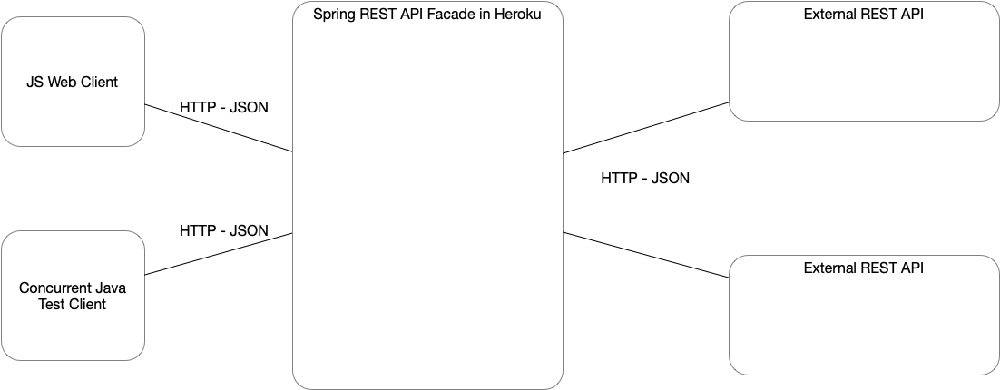

# Weather app

La aplicacion consta de in restAPI que hace consultas a otro externo y almacen cache para no re-hacer consultas.

Para ello usa una interfaz de persistencia y una clase que la implementa, internamente se usa un ConcurrentHashMap para evitar problemas de concurrencia sobre la persistencia de la aplicacion, en esta si ya se ha hecho una consulta la saca del cache, si no llama al API externo.

Tambien un clase que provee las consultas Http a los API externos, esta devuelve un String del archivo JSON de la consulta.

Las anteriores inyectadas mediante SpringBoot.

El restAPI provee la siguente ruta url/weather/{city} para optener el clima por ciudad.
los llamados al APIrest se hacen mediante javascript usando axios con llamados asincronos.

Se realizan pruebas concurrentes sobre la persistencia para verifiar su funcionamiento ante llamados concurentes.

Adicionalmente se provee en un archivo .zip que contiene un cliente que mediante JUnit hace pruebas concurrentes a este API, las pruebas se realizan directamente a Heroku.

### [link Heroku](https://parcial2-arsw.herokuapp.com)

Javadoc en apidocs/index.html en el repositorio

